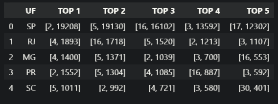
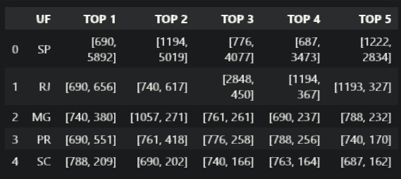
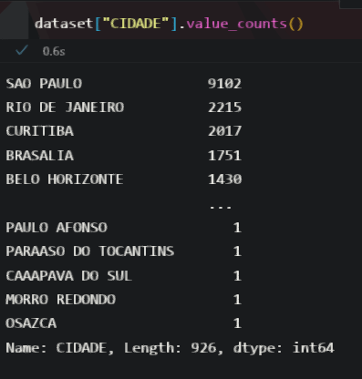
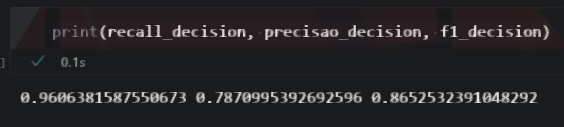
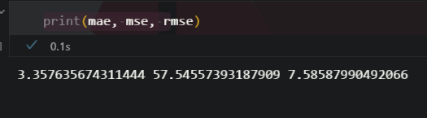

# Introdução

Case resolvendo o desafio proposto.

## Perguntas

### Faça uma exploração dos dados e mostre como a quantidade de leads varia de acordo com as outras variáveis (por exemplo, a marca ou o modelo afetam o recebimento de leads? O comportamento observado é o mesmo em todas as cidades?)

Podemos ver que os leads variam de acordo com as variáveis.

obs: os elementos das tabelas contém o seguinte formato:

```txt
[código, quantidade]
```

* cod_marca_veiculo (código da marca do veículo): foi analisado o top 5 de cada estado baseado na marca do veículo, e podemos ver que para cada estado as principais marcas variam.



* cod_modelo_veiculo (código do modelo veículo): o modelo também varia com cada estado, podemos ver que os mais cotados são:



Para otimizar a análise foi agregado as cidades por estado, tendo em vista que as capitais são muito mais expressivas e que os nomes identificadores de algumas cidades são inconclusivos.


### Proponha um modelo para determinar se um anúncio receberá lead. Que outras informações, as quais você não teve acesso, poderiam ajudar a chegar a conclusões melhores?

#### Modelo:

As seguintes colunas foram utilizadas para criar o modelo de classificação: "UF", "COD_MODELO_VEICULO", "COD_MARCA_VEICULO", enquanto a variável target é a "APRESENTA_LEAD", a qual representa quais veículos tiveram lead e quais não.

Foram criados dois modelos de Machine Learning e assim a partir de métricas como RECALL, PRECISION e F1 foi escolhido o modelo de Decision Tree, por apresentar algumas métricas melhores como a precisão, e pelo tempo de processamento ser menor também.

As métricas do modelo apresentados foram as seguintes:



Quanto as informações que não tive acesso, seria interessante para o modelo a presença da informação:

* Sinistro (quando houve algum dano no carro, como batidas);
* Troca de pneu na compra;
* Multa, se há multa em aberto relacionada ao carro;
* Eficiência, quantos quilômetros o carro pode fazer por litro.

### Proponha um modelo para determinar a quantidade de leads que um anúncio irá receber

Para o modelo de regressão, foram escolhidas as colunas "UF", "COD_MODELO_VEICULO", "COD_MARCA_VEICULO", "CLIQUES_TELEFONE*" e agora a coluna "LEADS" como target do modelo.

As métricas do modelo apresentados foram as seguintes:



O modelo escolhido nesse caso foi o de RandomForest por apresentar métricas melhores comparados ao DecisionTree, como por exemplo o MAE.

